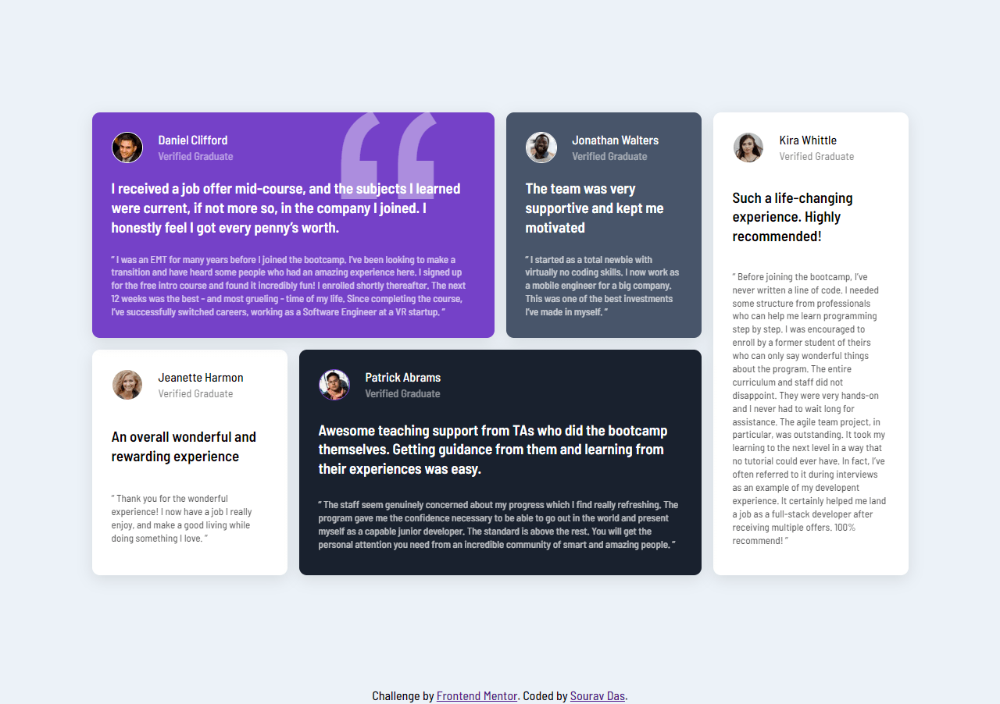

# Frontend Mentor - Testimonials grid section solution

This is a solution to the [Testimonials grid section challenge on Frontend Mentor](https://www.frontendmentor.io/challenges/testimonials-grid-section-Nnw6J7Un7). Frontend Mentor challenges help you improve your coding skills by building realistic projects.

## Table of contents

- [Overview](#overview)
  - [Screenshot](#screenshot)
  - [Links](#links)
- [My process](#my-process)
  - [Built with](#built-with)
  - [Continued development](#continued-development)
  - [Useful resources](#useful-resources)
- [Author](#author)

## Overview

### Screenshot

### Links

- Solution URL: [Github](https://github.com/souravone/testimonial-grid.io)
- Live Site URL: [Github Page](https://souravone.github.io/testimonial-grid.io/)

## My process

### Built with

- Semantic HTML5 markup
- CSS custom properties
- Flexbox
- CSS Grid
- Desktop-first workflow

### Continued development

I'd like to make this site more responsive.

### Useful resources

- [CSS Entities](https://oinam.github.io/entities/) - This helped me to search CSS entity for the left double quotation mark.

## Author

- Website - [Sourav Das](https://github.com/souravone)
- Frontend Mentor - [@souravone](https://www.frontendmentor.io/profile/souravone)
- Twitter - [@das*dev*](https://twitter.com/das_dev_)
